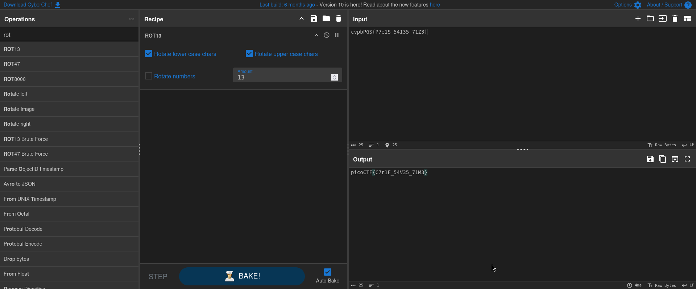

# CredStuff (Cryptography)
## Description
We found a leak of a blackmarket website's login credentials. Can you find the password of the user cultiris and successfully decrypt it? Download the leak here. The first user in usernames.txt corresponds to the first password in passwords.txt. The second user corresponds to the second password, and so on.

### Hints
1. Maybe other passwords will have hints about the leak?

## Solution
Reading the question and unzipping the tar file I'm prompted to restore the password of the user 'cultiris' and decipher it, after unzipping 2 files appeared 'passwords.txt' and 'usernames.txt', those files where corrosponding to each other as written in the question which means in the index I find 'cultiris' in the username.txt file I will find his password in the same index in the 'password.txt'
using the command `wc -l usernames.txt` & `wc -l passwords.txt` to check the number of lines and both gave me the same answer, next step I am going to read the users into a list in python to check for the indexes using the following script:

```
usernames_path = "./leak/usernames.txt"
passwords_path = "./leak/passwords.txt"
username = input("Enter the username for information:  ")
 

try:
    with open(usernames_path,"r") as f:
        usernames = f.read().split("\n")
except(Exception):
    print(Exception)
try:
    with open(passwords_path, "r") as p:
        passwords = p.read().split("\n")
except(Exception):
    print(Exception)


def find_password(user_index):
    for i in range(0, len(passwords)):
        if i == user_index:
            print(f"The password of the user is {passwords[i]}")
        else:
            continue

def find_user(name):
    for index, username in enumerate(usernames):
        if name == username:
            print(f"The username {username} is found with index {index}")
            find_password(index)
            break
        else:
            continue

find_user(username)
```

this is the output
```
Enter the username for information:  cultiris
The username cultiris is found with index 377
The password of the user is cvpbPGS{P7e1S_54I35_71Z3}
```
Now the password is in the flag format but ciphered somehow so I took it to CyberChef.



ROT 13 was been used to keep the password safe
PWNED!