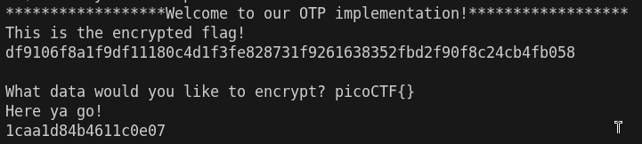
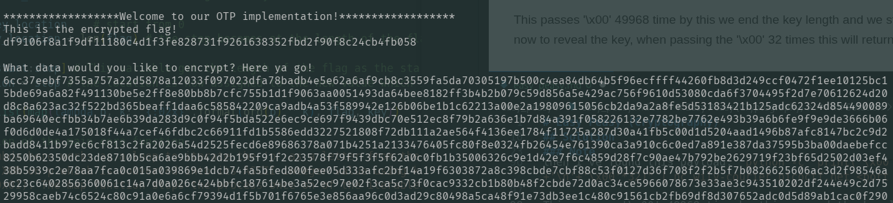
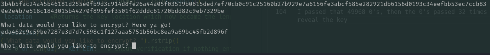
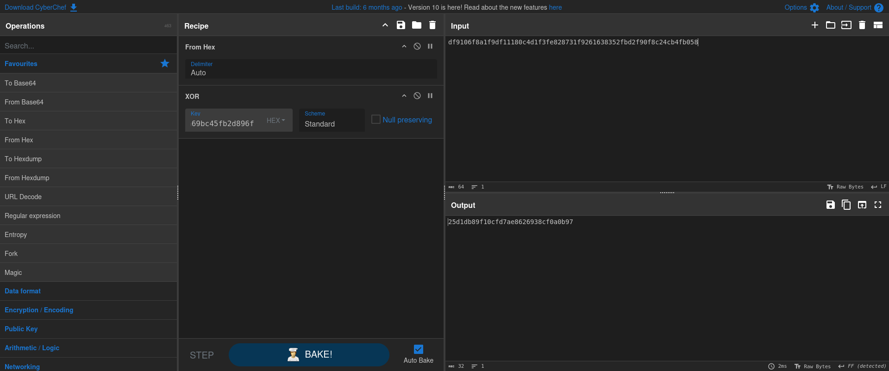

# Easy Peasy (Cryptography)
## Description 
A one-time pad is unbreakable, but can you manage to recover the flag? (Wrap with picoCTF{})

Additional details will be available after launching your challenge instance.

### Hints
1. Maybe there's a way to make this a 2x pad.

## Solution
I did a simple research about OTP to understand how it works and I've understanded the following;
The One Time Pad (OTP) is a classical encryption technique which might be near for perfectionism of security if used correctly, it is also a **Symmetric Encryption** technique.
- The plain text is encrypted by combining it with a random key of the smae lenght
- Each letter from the plain text is associated with a value (A=0, B=1, C= 2 and so on).
- The combination process happens using a modular arithmetic keys
    - Encryption formula: ***Ci = (Pi + Ki) mod 26***
    - Decryption formula: ***Pi = (Ci - Ki + 26) mod 26***

Note: Pi = plaintext, Ci = ciphertext, and Ki = keytext.

Now I'm ready to launch the instance and I was provided a file of an OTP python program, after reading and analyzing the program:

### Note
This is an altered code with **COMMENTS ONLY**  and the real code is provided in the question.
```
#!/usr/bin/python3 -u
import os.path

KEY_FILE = "key"
KEY_LEN = 50000
FLAG_FILE = "flag"


def startup(key_location): # the key location always starts at 0 
	flag = open(FLAG_FILE).read()
	kf = open(KEY_FILE, "rb").read() # reading it in byte mode

	start = key_location	# start from 0
	stop = key_location + len(flag) # the stop becomes at the length of the flag

	key = kf[start:stop] # This variable get the length of the flag as the start from 0 and ends at the flag length 
	key_location = stop # the location is now assigned to the new value which is the length of the flag

	result = list(map(lambda p, k: "{:02x}".format(ord(p) ^ k), flag, key))

	#Explanation of the main core function
	'''The lambda here works as a loop to iterate the 'p' as a letter from the flag and 'k' as a byte from the key, and then
	apply the XOR on p which is converted into its ASCII integer value using k, and then formatted into 2 hexa places 
	(eg. 1 = 0x01). The map function stops the process once on of the iterables is exhausted.'''


	print("This is the encrypted flag!\n{}\n".format("".join(result)))

	return key_location		#Returns the key location which now became the length of the flag

def encrypt(key_location):
	ui = input("What data would you like to encrypt? ").rstrip()
	if len(ui) == 0 or len(ui) > KEY_LEN:	# input verification if nothing entered or input is greate than 50000
		return -1

	start = key_location	# Start from the flag length and not 0 as used below
	stop = key_location + len(ui) # a new length is generated by adding the input length of the user to the length of the flag

	kf = open(KEY_FILE, "rb").read()

	if stop >= KEY_LEN:		#Checking if the length is greater than 50000
		stop = stop % KEY_LEN	# if so the new value will be the modulus(reminder) of dividing the old stop value with 50000 
		key = kf[start:] + kf[:stop]	# the length of the key will be starting from the length of the flag and stop at the new location
	else:
		key = kf[start:stop]
	key_location = stop

	result = list(map(lambda p, k: "{:02x}".format(ord(p) ^ k), ui, key)) # same concept as the previous, and no going back just carrying on

	print("Here ya go!\n{}\n".format("".join(result)))

	return key_location


print("******************Welcome to our OTP implementation!******************")
c = startup(0)
while c >= 0:
	c = encrypt(c)

```

I've understanded that the function "startup" runs only at the beginning of the code and the rest is done by "encrypt", this won't make a problem except for the key offsets which is changing after each process is done.
I run an the machine and I got the encrypted flag:

 

By calculating the number of characters in the flag it is 64 characters which means a 32 bytes flag, I realized that the next encryption will starting with the key from the 32 position up to the length of the user input, so in order to get flag we have to apply the XOR operation using the same keys and to do this I have to start from 0 and end at 32 offset from the Key length.

To apply the idea I've to get till the end of the encrypting key and start it from 0 as if the end of the key length is reached the ```stop = stop % KEY_LEN``` will start the key from the beginning and then I will pass a bunch of 0's to return the key used to encrypt (0 XOR 1 = 1). I made a another quick search to know what is the best way to implement the idea.

then I've found this payload: `python -c "print('\x00'*(50000-32)+'\n'+'\x00'*32)" | nc wily-courier.picoctf.net <port number>`

This passes '\x00' 49968 time by this we end the key length and we start from the beginning now to reveal the key, when passing the '\x00' 32 times this will return the 32 position after the 0 and when XORed with the value 00 the same value will be returned which will be the hex encoded key as the file is read in byte mode.

by running the command:



I passed that 49968 times of "\x00", then the "\x00" passed 32 times again to reveal the key



Now I got the hex encoded key, I will use "CyberChef" for decoding.



"From Hex" is used as the flag is formatted in Hex after XORing with the hex encoded key decoded automatically in the option used, by literal reversing of the process we get the flag back.`25d1db89f10cfd7ae8626938cf0a0b97`
I wrapped it in the formal way for the website `picoCTF{25d1db89f10cfd7ae8626938cf0a0b97}` and submitted.

PWNED!