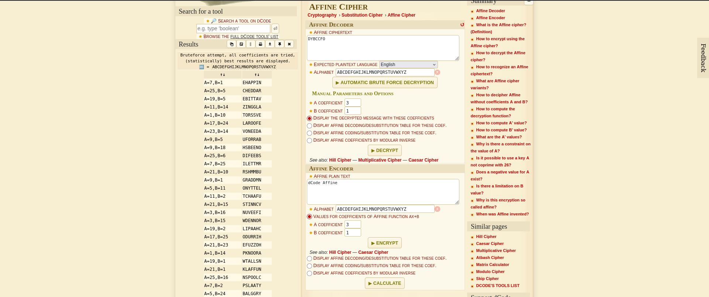

# Guess My Cheese 1 (Cryptography)
## Decsription
Try to decrypt the secret cheese password to prove you're not the imposter!

Additional details will be available after launching your challenge instance.

### Hints
1. Remember that cipher we devised together Squeexy? The one that incorporates your affinity for linear equations???

## Solution
Started by running the instance and got the following message:
`Try to decrypt the secret cheese password to prove you're not the imposter! Connect to the program on our server: nc verbal-sleep.picoctf.net 53985`

and after getting connected to the machine I got the following message:
```
***    The Mystery of the CLONED RAT    ***
*******************************************

The super evil Dr. Lacktoes Inn Tolerant told me he kidnapped my best friend, Squeexy, and replaced him with an evil clone! You look JUST LIKE SQUEEXY, but I'm not sure if you're him or THE CLONE. I've devised a plan to find out if YOU'RE the REAL SQUEEXY! If you're Squeexy, I'll give you the key to the cloning room so you can maul the imposter...

Here's my secret cheese -- if you're Squeexy, you'll be able to guess it:  CZCFQQTGFQ
Hint: The cheeses are top secret and limited edition, so they might look different from cheeses you're used to!
Commands: (g)uess my cheese or (e)ncrypt a cheese
What would you like to do?
```

I passed the 'g' command and I've got an encrypted word (cheese) : `CZCFQQTGFQ` I tried to decode it using "dCode" but nothing in retrun, I read the hint as I don't know anything to do right now, and it say something about the affine linear equation for encyption, so I'd nothing to do except searching for it.

***Affine Linear Equation***
Thanks for the website "[GeeksForGeeks](https://www.geeksforgeeks.org/dsa/implementation-affine-cipher/)".
Affine cipher, a type of monoalphabetic substitution cipher, wherein alphabets are mapped into a new numeric values using a mathemetical equation. The whole process depends on working modulo 'm' the length of aphabetic used, due to the alphabets mapped from (0...m-1).
The key consist of 2 numbers a & b, whereas 'a' should be relatively prime to 'm' (a should not have shared factor with 'm')
For Encryption: ***ciphertext = (ax + b) mod m***
For Decryption: ***plaintext = a<sup>-1</sup> (x - b) mod m***

In addition, a python code was already provided in the explanation which I modified a little bit to suit my case.
```
# Implementation of Affine Cipher in Python

# Extended Euclidean Algorithm for finding modular inverse
# eg: modinv(7, 26) = 15
def egcd(a, b):
    x,y, u,v = 0,1, 1,0
    while a != 0:
        q, r = b//a, b%a
        m, n = x-u*q, y-v*q
        b,a, x,y, u,v = a,r, u,v, m,n
    gcd = b
    return gcd, x, y

def modinv(a, m):
    gcd, x, y = egcd(a, m)
    if gcd != 1:
        return None  # modular inverse does not exist
    else:
        return x % m


# affine cipher encryption function 
# returns the cipher text
def affine_encrypt(text, key):
    '''
    C = (a*P + b) % 26
    '''
    return ''.join([ chr((( key[0]*(ord(t) - ord('A')) + key[1] ) % 26) 
                  + ord('A')) for t in text.upper().replace(' ', '') ])


# affine cipher decryption function 
# returns original text
def affine_decrypt(cipher, key):
    '''
    P = (a^-1 * (C - b)) % 26
    '''
    return ''.join([ chr((( modinv(key[0], 26)*(ord(c) - ord('A') - key[1])) 
                    % 26) + ord('A')) for c in cipher ])


# Driver Code to test the above functions
def main():
    # declaring text and key
    text = 'DLYQNVXEOCHBK'
    key = [25, 5]

    # calling encryption function
    affine_encrypted_text = affine_encrypt(text, key)

    print('Decrypted Text: {}'.format( affine_encrypted_text ))

    # calling decryption function
    print('Encrypted Text: {}'.format
    ( affine_decrypt(affine_encrypted_text, key) ))


if __name__ == '__main__':
    main()
```
I'd everything ready to start except for the keys used in the encryption, which I can get from running the program again and obtain the ciphered text and try to decrypt it using the website "dCode".
```
Option 'e' is choosed
What cheese would you like to encrypt? Cheddar
Here's your encrypted cheese:  ONYTTEL
Not sure why you want it though...*squeak* - oh well!

I don't wanna talk to you too much if you're some suspicious character and not my BFF Squeexy!
You have 2 more chances to prove yourself to me!

Commands: (g)uess my cheese or (e)ncrypt a cheese
What would you like to do?
```
Now I will take the encrypted cheese and try to brute force the cheese in the website.



and I got the keys A=25 and B=6. now using the python script got from the "GeeksForGeeks"
I decrypted the cheese and I got `CUHPSKIBRDYEV` I submitted the chees of to the rat in lower case and got the flag.

PWNED!