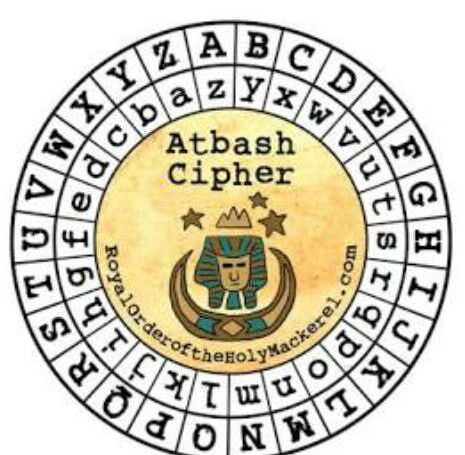

# HideToSee (Cryptography)
## Description
How about some hide and seek heh? Look at this image here.

### Hints
1. Download the image and try to extract it.

## Solution
I downloaded the link content and it was an image



The first thing I thought about is using the name of the image "atbash" and take he corrosponding letters from the message and I got 'ZGYZHS' which was ofcurse not correct, so I made a research about this type of cipher.
I found that the Atbash cipher is a very common and simple cipher that simply encodes a message with the reverse of the alphabet. Initially it was used with Hebrew. Basically, when encoded, an "A" becomes a "Z", "B" turns into "Y", that means I was in the right track but with the wrong word, so I read the question again and nothing to get, I'd to read the hints to get any idea about anything; and it says extract the image, so I tried the first extracting tool of extracting data from images but nothing is interesting, so I did use the command `strings` on the image and I got something:
```
JFIF
 , #&')*)
-0-(0%()(
((((((((((((((((((((((((((((((((((((((((((((((((((
$3br
%&'()*456789:CDEFGHIJSTUVWXYZcdefghijstuvwxyz
        #3R
&'()*56789:CDEFGHIJSTUVWXYZcdefghijstuvwxyz
>E!`:
j2HO?
zLe&
77ZM
N5h5E
7O;
0BS?
I#hz
"H=T
H2!fr
.lu}
xldd
------Omitted Ouput------
```

I was keeping an eye on this `CDEFGHIJSTUVWXYZcdefghijstuvwxyz` I thought that its meant for something so I decided to use an online tool either "CyberChef" or "dCode". Unfortunately nothing in return!

So I tried "steghide" for extracting jpeg data using the commad `steghide info atabsh.jpg` and got a file "encrypted.txt":
```
"atbash.jpg":
  format: jpeg
  capacity: 2.4 KB
Try to get information about embedded data ? (y/n) y
Enter passphrase: 
  embedded file "encrypted.txt":
    size: 31.0 Byte
    encrypted: rijndael-128, cbc
    compressed: yes
```
Next I used the `steghide extract -sf atbash.jpg` to extract the embedded file but I was prompted a password, tbh I tried several common passwords and none of them work until I hit enter without a password and fortunately worked, and got:
```
Enter passphrase: 
wrote extracted data to "encrypted.txt".
```
reading the file I got the flag but encrypted in atbash I belief `krxlXGU{zgyzhs_xizxp_8z0uvwwx}`
So I used CyberChef to decode it
PWNED!