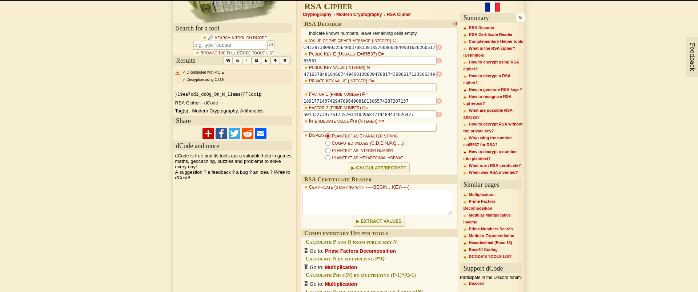

# Mind your Ps and Qs (Cryptography)
## Description
In RSA, a small e value can be problematic, but what about N? Can you decrypt this? values

### Hints
Bits are expensive, I used only a little bit over 100 to save money

## Solution
Before I proceed to the answer I went to read about RSA and know the formulas related to the topic;

***RSA (RIVEST-SHAMIR-ADLEMAN) Cryptosystem***
A cryptic technique taht uses 'asymmetric encryption' to transfer data securly. It consists of seceral components;
- p = large prime number
- q = large prime number
- n = p * q
- r = (p-1)(q-1)
- e = 3, 5, 17, 65537 (fixed values, the higher the value the higher the security)
- d = e<sup>-1</sup> mod(r)
- public key = (e, n)
- private key = d

For encryption: m<sup>e</sup> mod(n)
For decryption: c<sup>d</sup> mod(n)
! m = plaintext, while c = ciphertext!

Now I'm ready to start decrypting the message, I downloaded the file and examined the information provided;
```
Decrypt my super sick RSA:
c: 15341890103764929939105506004034128738090325640037083301857608662849501626260517
n: 948406957756830799684818171639547165784816468744946013083947881743680617123566349
e: 65537

```
From the provided information I can see that the cipher text is provided, the n and e, as well. The missing parts are the 'p' and 'q' which I can get from getting any 2 prime factor of n for that I am going to use a website "https://www.factordb.com/", after factorizing the 'n' I got the value of 'p' and 'q':
```
p = 1891771437429478964908181306574287207137
q = 501332739776173570344039681219489434626477

```

Now there we got all the values there is 2 ways to solve the question, either with an already existing tool like "https://www.dcode.fr/rsa-cipher", or by crafting a python script to decrypt the cipher. I will use both in this question 

### Dcode website

Provided each value in the right place and this revealed the flag but reversed, this ain't a problem at all by a python small script will return the right value
```
flag = " }19ea7cd1_do0g_0n_N_11ams{FTCocip"

# Technique 1
reversed_flag = "".join(reversed(flag))
print(reversed_flag)

# Technique 2
rev_flag = ""
for i in range(1,len(flag)):
    rev_flag += flag[-i]

print(rev_flag)
```
### Python Script for decoding RSA
```
import binascii

#constants
c = 15341890103764929939105506004034128738090325640037083301857608662849501626260517
n = 948406957756830799684818171639547165784816468744946013083947881743680617123566349
e = 65537
p = 1891771437429478964908181306574287207137
q = 501332739776173570344039681219489434626477
r = (p-1) * (q-1)
d = pow(e, -1, r)

decoded_value = pow(c, d, n)
# Convert to bytes and decode as string (assuming the message is text)

plaintext_bytes = decoded_value.to_bytes((decoded_value.bit_length() + 7) // 8, 'big')
plaintext = plaintext_bytes.decode('utf-8', errors='ignore')

# The flag is reversed, so reverse it
flag = plaintext[::-1]
print(flag)
```
Output
```
picoCTF{sma11_N_n0_g0od_1dc7ae91}
```
PWNED!