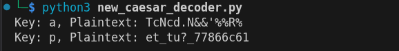

# New Caesar (Cryptography)
## Description
We found a brand new type of encryption, can you break the secret code? (Wrap with picoCTF{}) fegdeogdgecoeocgcgchcfcffccfca (new_caesar.py) > link to download the python program

### Hints
1. How does the cipher work if the alphabet isn't 26 letters?
2. Even though the letters are split up, the same paradigms still apply

## Solution
I've started first thing by download and examining the file from the question,
!Note: The code below is modified by adding ***Comments Only*** for personal understanding! The real code will be provided in the question.

```
import string

LOWERCASE_OFFSET = ord("a")	# 97 HTML number of the letter a
ALPHABET = string.ascii_lowercase[:16] # retrieve a-p list for cipher

def b16_encode(plain):	
	enc = ""
	for c in plain:
		binary = "{0:08b}".format(ord(c))	# format the first arguement and make it in the 8 bit format
		enc += ALPHABET[int(binary[:4], 2)]	# convert the first 4 bit to letters
		enc += ALPHABET[int(binary[4:], 2)]	# conver the last 4 bits to letters
	return enc	#return the whole encoding

def shift(c, k):
	t1 = ord(c) - LOWERCASE_OFFSET	# Deduct the order of the first argument by 97
	t2 = ord(k) - LOWERCASE_OFFSET	# Do the same for k
	return ALPHABET[(t1 + t2) % len(ALPHABET)]	# Retrun the remaining of the division operation between the added t1 and t2 divided by the length of list a-p

flag = "redacted"	# the real value is "radacted"
key = "redacted"	# the real value is "radacted"
assert all([k in ALPHABET for k in key])
assert len(key) == 1

'''The assert built in function or keyword here is used for checking the right condition passed into it and as I see
it will produce an error because in the line 21 the loop will check for r which is not in the list of ALPHABET 
and line 22 the key length is no 1 so another error modification is to be done'''

b16 = b16_encode(flag)	
enc = ""
for i, c in enumerate(b16):	# a loop for the index and content of the index
	enc += shift(c, key[i % len(key)])
print(enc)
```

After a long reading and code analyzing, I came out with a script to reverse the whole process and print the printable letter and characters

```
import string

# Constants
enc_flag = "fegdeogdgecoeocgcgchcfcffccfca"
ALPHABET = string.ascii_lowercase[:16]
LOWERCASE_OFFSET = ord("a")

def b16_decoder(cipher):
    decoded = ""
    listed_4b = []
    listed_8b = []
    for i in cipher:
        for k, j in enumerate(ALPHABET):
            if i == j:
                listed_4b.append(format(k,'04b'))

    for i in range(0, len(listed_4b),2):
        listed_8b.append(listed_4b[i] + listed_4b[i+1])

    for i in listed_8b:
        bin = int(i,2)
        decoded+= chr(bin)

    return decoded

def unshift(c, k):
    t1 = ord(c) - LOWERCASE_OFFSET
    t2 = ord(k) - LOWERCASE_OFFSET
    return ALPHABET[(t1 - t2) % len(ALPHABET)]


def decrypt(enc, key):
    dec = ""
    for i, c in enumerate(enc):
        dec += unshift(c, key[i % len(key)])
    return dec

for k in ALPHABET:
    decrypted = decrypt(enc_flag, k)
    if all([c in ALPHABET for c in decrypted]):
        decoded = b16_decoder(decrypted)
        if all([c in string.printable for c in decoded]):
            print(f"Key: {k}, Plaintext: {decoded}")
```

When running this script I got 2 outputs



Afterall! the key was "p". 

PWNED!