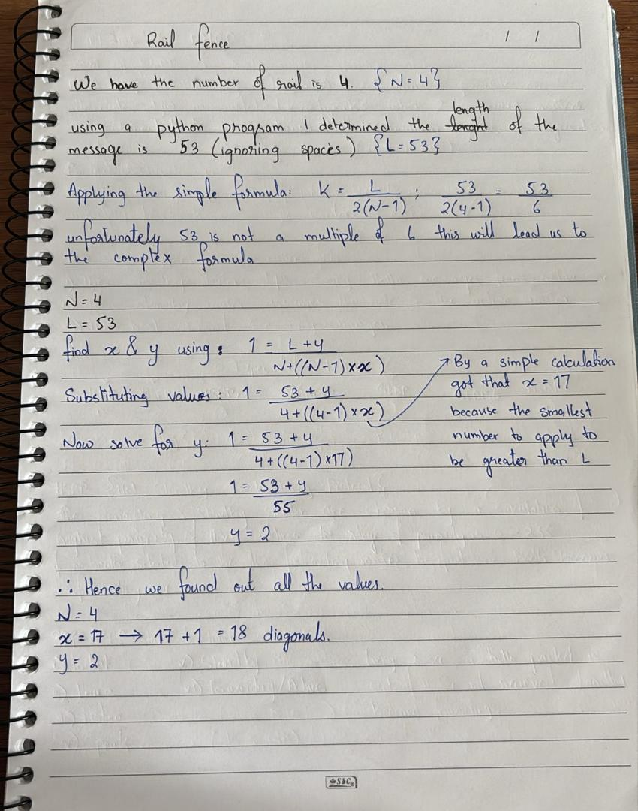
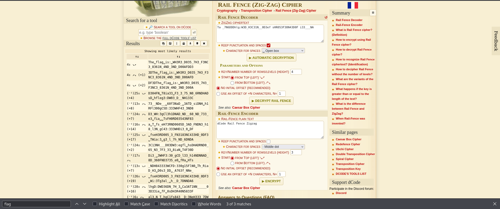

# Rail Fence (Cryptography)
## Description
A type of transposition cipher is the rail fence cipher, which is described here. Here is one such cipher encrypted using the rail fence with 4 rails. Can you decrypt it? Download the message here. Put the decoded message in the picoCTF flag format, picoCTF{decoded_message}.

### Hints
1. Once you've understood how the cipher works, it's best to draw it out yourself on paper

## Solution
I started by downloading the files provided in the server for the challenge
message.txt:
```
Ta _7N6DDDhlg:W3D_H3C31N__0D3ef sHR053F38N43D0F i33___NA
```
The other file was 'Rail_fence_cipher' without an extensino so I was curious about it when I examined it, a long HTML file with a long code I can't provide here I used a browser to see the content, and a complete tutorial about how to use the Rail Fence from encryption to decryption and so on. But I understood that the messaeg is to be decrypted using the steps provided in the other HTML file.

#### Rail Cipher
Also know as ZigZag cipher as a classic type of transpositional cipher. The text is written out in a *Diagonal* aspect can't be read only when positioned in the right track.
```
W . . . E . . . C . . . R . . . U . . . O . . . 
. E . R . D . S . O . E . E . R . N . T . N . E 
. . A . . . I . . . V . . . D . . . A . . . C .
```

For Decryption:
Let **N** be the number of rails used in encryption. The rail is the number of lines used in the cipher, while **K** is the order of the message;

Decryption fromula: ***K = $\frac{L}{2 (N-1)}$***

After finding K the ordering goes top and bottom rails are K, while the middle rails are 2K due to the appearance of 2 times in the rail cycle.

If L is not mulitple of 2(N-1) this gets the work more complicated by making the L multiple of 2(N-1); we wukk add two variables, **x** and **y**.
Where; x+1 = the number of diagonals in the decrypted rail, and y = the number of empty spaces in the last diagonal.

Hence the formual will be: ***1 = $\frac{L+y}{N+((N-1) * x)}$***

Next to solve for x & y algebrically, x and y both are the smallest number possible for the equation, this is done by ***x+1*** untl the denomenator is grater than ***L***, then solve normally for y

!Note: if the cipher text is the same as the plaintext, therefore the number of usable key is low, allowing to brute force all the possible values.

Now ready to start solving, I went back for the message but I saw nothing from what I just studied, until I read the quesiton again and I saw that this text is using a rail of 4 which is N, now to calculate the message length (Ignoring the spaces and punctuation) 
This are the values after working out by the formula:



It was difficult and time consuming to do it manually on a paper, but really tought me something that in this message the space is not ignored unless told, so instead of doing the process again I used the website "https://www.dcode.fr/rail-fence-cipher" to decode faster;



PWNED!