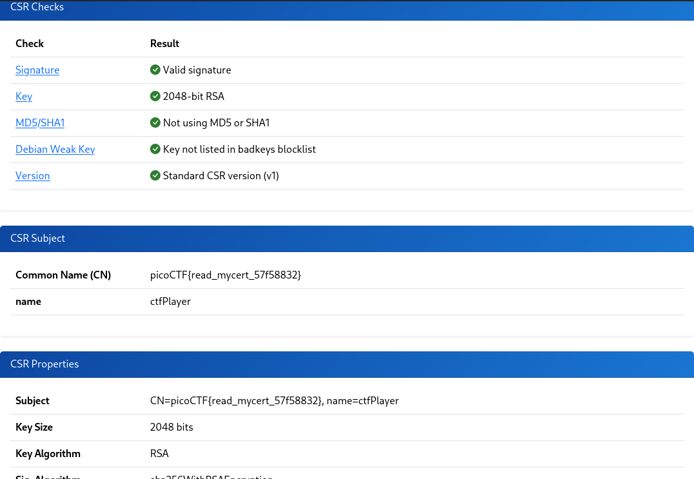

# Read My Cert (Cryptography)
## Description
How about we take you on an adventure on exploring certificate signing requests Take a look at this CSR file here.

### Hints
1. Download the certificate signing request and try to read it.

## Solution
Starting with downloading the file and checking the content, the output is the following:

```
-----BEGIN CERTIFICATE REQUEST-----
MIICpzCCAY8CAQAwPDEmMCQGA1UEAwwdcGljb0NURntyZWFkX215Y2VydF81N2Y1
ODgzMn0xEjAQBgNVBCkMCWN0ZlBsYXllcjCCASIwDQYJKoZIhvcNAQEBBQADggEP
ADCCAQoCggEBANZde4bKP/88bBY0RM2b+EyGoxWqWsADa7QIPRZM4jTAxPTC39Ld
6iDZwfA6Cu33KvkZbu1JpAFk/6O/lY+iwSCcZnBTp1p+Skn/BpIwW7KBEjnczulA
c/u4GYQgpU5Pxxd/gvOHLNtWHw8FjcHAV78Y23cwwfO1Gfae5eYrxHMa/nCiQmjC
9GwRsj2+cPmWiyFs1ntLREBGUKWBIHGoTR+ZMXv9aBeasIUlzWap/4ZsSOqoqzAL
3geZ9TfWd/pHtYgqA1jV60ogmWD2LKMU9F4s+5dJveO/5kV7kkpk+7VX3xlE1t/S
0/ThtcNU51WdfmFREr2hCUJgicQHbkkwq00CAwEAAaAmMCQGCSqGSIb3DQEJDjEX
MBUwEwYDVR0lBAwwCgYIKwYBBQUHAwIwDQYJKoZIhvcNAQELBQADggEBAHihiiyg
z69vMceQR0gOoTZS1RQKafdyX64IxwEuHdV8I0To+3VQp+3yp2yHNAjLxLEIam6f
4dlTZlWSSttHSjp1WjoabpQrSp7ANgTuLFwBsQkbXY72wm0LVrdSi1tuKTnl82vM
mXccuWLUXy71wmzKR+Wekf5JXX9AwFAEVedyAW5EP+bNOP/hQr1kiOCWge3pmGUq
9fVYITJs6gZ6aiDwx4O2jdJuP3CG1QRrKer89mgw5GkgvcVn38s7BF24kRddcBK1
RGSntFXy1CDUd55IhSoADxrZoXT5+5+GokM85JKTkwS9L/VGe2ZQuym+NyIkbfBm
I+FejxNz7x4Fmzg=
-----END CERTIFICATE REQUEST-----
```

I went to make a research about the certs and how to decrypt them if possible.

So after clearly understanding what a certificate is I tried to decode it myself in CyberChef but didn't find an option to decrypt a certificate, I kept searching for cert decryptor and found one "https://certlogik.com/decoder", I pasted the output of the file there and got some metadata from the certificate and one of that is the flag.



PWNED!