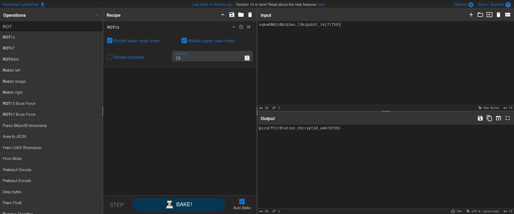

# Rotation (Cryptography)
## Description
You will find the flag after decrypting this file Download the encrypted flag here.
### Hints
1. Sometimes rotation is right

## Solution
I started by downloading the file, then I saw the file in the extension of text ".txt", so I used the following command to read the content of the file.
```
$ cat encrypted.txt
xqkwKBN{z0bib1wv_l3kzgxb3l_i4j7l759}
```

The output looks familiar to me from previous challenges and I think that it is a ROT encryption, so I head up to Cyber chef to decrypt it.

At the beggining it didn't make sense using the rotation amount of 13 which is the default rotation value. I started increasing the value until the real flag revealed and the key was the value 18.



PWNED!