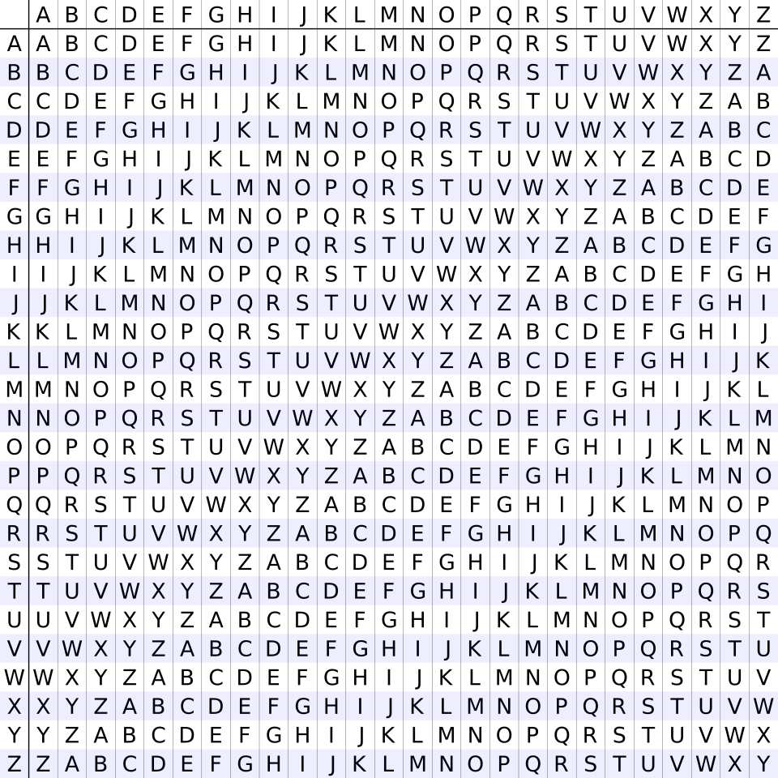
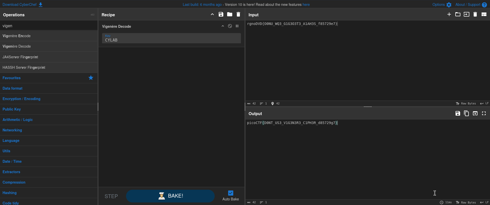

# Vigenere (Cryptography)
## Description
Can you decrypt this message? Decrypt this message using this key "CYLAB".

### Hints
https://en.wikipedia.org/wiki/Vigen%C3%A8re_cipher

## Solution
After downloading the file and examining the output was the flag ciphered `rgnoDVD{O0NU_WQ3_G1G3O3T3_A1AH3S_f85729e7}`, I was provided with the key in the question which was "CYLAB", before doing anything I wanted to learn more about how the vigenere Cipher works, so I head up to the hint provided which was an explanation for the cipher technique.

For example, if the plaintext is attacking tonight and the key is oculorhinolaryngology, then

the first letter of the plaintext, a, is shifted by 14 positions in the alphabet (because the first letter of the key, o, is the 14th letter of the alphabet, counting from zero), yielding o;

the second letter, t, is shifted by 2 (because the second letter of the key, c, is the 2nd letter of the alphabet, counting from zero) yielding v;

the third letter, t, is shifted by 20 (u), yielding n, with wrap-around; and so on. 
and this is done using this image:

pusing the letter as per the key position written below it, the letter of the plaintext will be shifter to the location of the key postion forming a new letter and later by combining a completely new message will be generated.

Now after understanding the mechanism of the technique and for time saving I will use "CyberChef" to decode the message using the key "CYLAB" and this was the output:

PWNED!