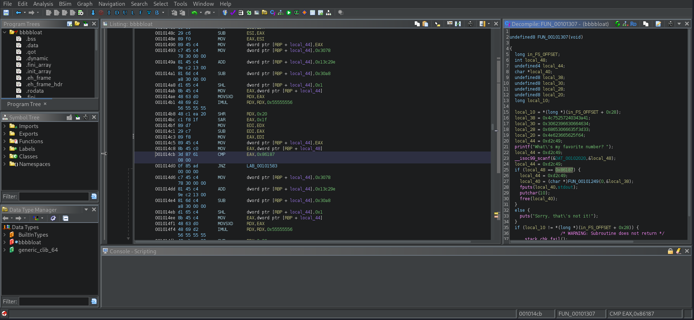

# Bbbbloat
## Description
Can you get the flag? Reverse engineer this binary.

### Hints
none

## Solution
Starting by downloading the binary and examining the content, using the command `chmod +x bbbbloat` to make the binary executable and `./bbbbloat` for running the program. And I got this output prompting me for input.
```
What's my favorite number?
```
there is no source code to understand from, so I used ghidra a reverse engineering tool to see If I can find somthing.

and I saw that a value is compared to the input passed to the program so I decoded that value into decimal to check what is the number and it turns out `549255`.
```
What's my favorite number? 549255
picoCTF{cu7_7h3_bl047_695036e3}
```