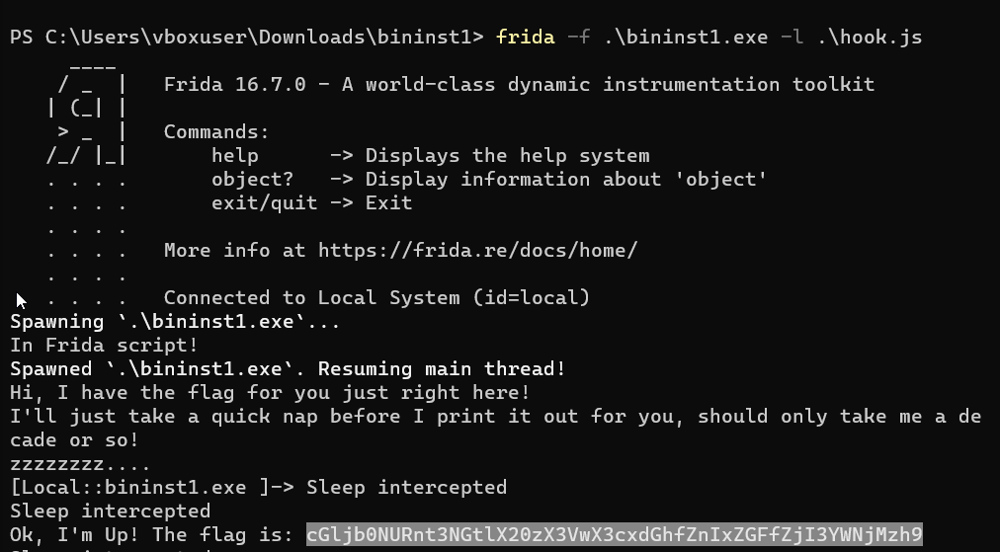

# Binary Instrumentation 1 
## Description
I have been learning to use the Windows API to do cool stuff! Can you wake up my program to get the flag? Download the exe here. Unzip the archive with the password picoctf 

### Hints
1. Frida is an easy-to-install, lightweight binary instrumentation toolkit
2. Try using the CLI tools like frida-trace to auto-generate handlers

## Solution
Starting by downloading the zip file and uznip it, next I started searching for useful information using ghidra but nothing to mention. Then I read the hints, to find that this challenge is to be solved using a python library tool called "Frida". This tool is used to hook and manipulate function while the program is running, so I searched for a javascript script for skipping the sleep part and carry on until the flag is printed
```
var k32 = Module.findExportByName("kernel32.dll", "Sleep")  
  
if (k32) {  
       Interceptor.replace(k32, new NativeCallback(function(ms) {  
               console.log("Sleep Intercepted!")  
               return // Skip the sleep  
       }, "void", ["uint32"]))  
}
```

Then I run the program using Frida with the command

`cGLjb0NURnt3NGtlX20zX3VwX3cxdGhfZnIxZGFfZjI3YWNjMzh9` converting this from base 64 `picoCTF{w4ke_m3_up_w1th_fr1da_f27acc38}`