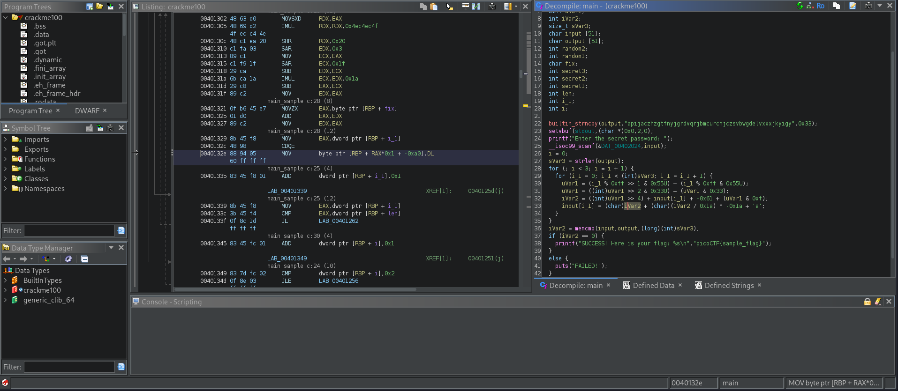

# Classic Crackme 0x100
## Desciption
A classic Crackme. Find the password, get the flag! Binary can be downloaded here. Crack the Binary file locally and recover the password. Use the same password on the server to get the flag! Access the server using nc titan.picoctf.net port

### Hints
1. Let the machine figure out the symbols!

## Solution
Starting by downloading the file `crackme100` and examining the characteristics;
```
└─$ file crackme100 
crackme100: ELF 64-bit LSB executable, x86-64, version 1 (SYSV), dynamically linked, interpreter /lib64/ld-linux-x86-64.so.2, BuildID[sha1]=4c56306c51af336d758655e03368b457f2f4c356, for GNU/Linux 3.2.0, with debug_info, not stripped
```
then giving the program the permission to execute using the command `chmod +x crackme100` and running it
```
└─$ ./crackme100 
Enter the secret password: password
FAILED!
```
I used the `strings` command to check for anything interesting but nothing to mention so I head up to ghidra;

by reading the code and converting it into more readable code like python
```
c = "apijaczhzgtfnyjgrdvqrjbmcurcmjczsvbwgdelvxxxjkyigy"
p = ['' for _ in c]

for i in range(3):
    for j in range(len(c)):
        v7 = (85 & (j % 255)) + (85 & ((j % 255) >> 1))
        v6 = (v7 & 51) + (51 & (v7 >> 2))
        x = (ord(c[j]) - 97) % 26
        y = (x - ((v6 & 15) + (15 & (v6 >> 4)))) % 26
        p[j] = chr(y + 97)

    c = ''.join(p)

print(c)
```
output `amfdxwtywanwhpauoxphlasawliqdxqkppvnauvzpoolaymtap` which i will assume it is the password.
Then connected to the machine to submite the password and get the flag
```
└─$ nc titan.picoctf.net 58544
Enter the secret password: amfdxwtywanwhpauoxphlasawliqdxqkppvnauvzpoolaymtap
SUCCESS! Here is your flag: picoCTF{s0lv3_angry_symb0ls_e1ad09b7}
```
PWNED!