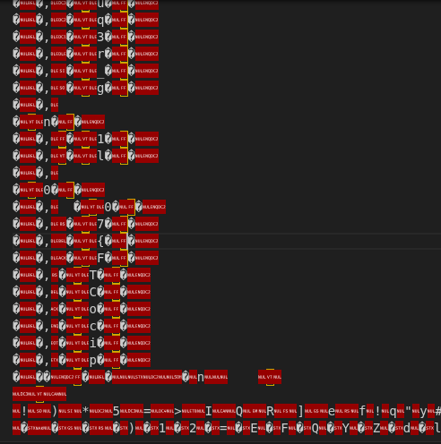
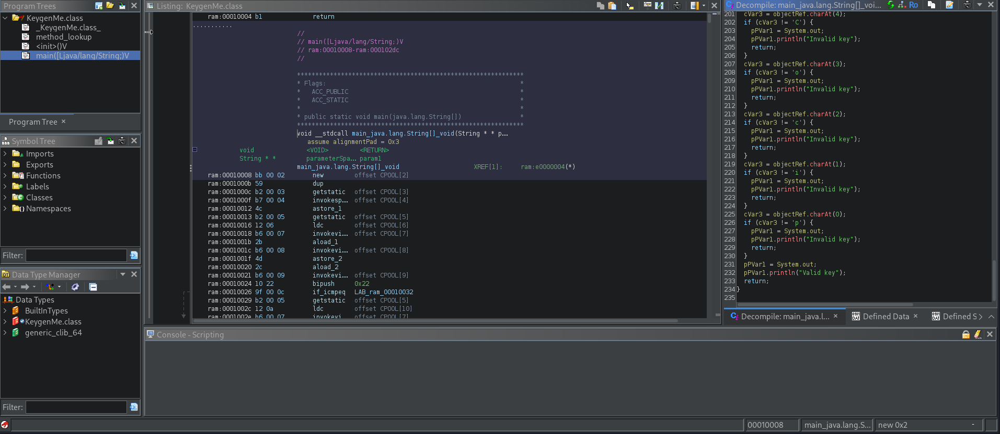

# Fresh Java
## Description
Can you get the flag? Reverse engineer this Java program.
### Hints
1. Use a decompiler for Java!

## Solution
Starting by downloading the file from the challenge and examine the content of the file; I can see the content of the flag but in the java class

But this is not the way to get the flag as written in the hint we need to use a decompiler for java which can be ghidra

and found the flag in the same way but cleaner, using chatgpt for faster collection and ordering of letters.`picoCTF{700l1ng_r3qu1r3d_9332a6be}`
PWNED!