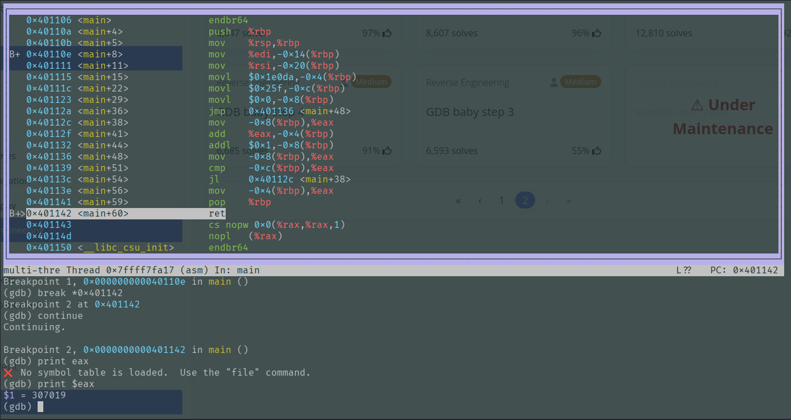

# GDB Baby Step 2
## Description
Can you figure out what is in the eax register at the end of the main function? Put your answer in the picoCTF flag format: picoCTF{n} where n is the contents of the eax register in the decimal number base. If the answer was 0x11 your flag would be picoCTF{17}. Debug this.

### Hints
1. You could calculate eax yourself, or you could set a breakpoint for after the calculcation and inspect eax to let the program do the heavy-lifting for you.

## Solution
Starting by downloading the file and checking the characterestics using the command `file debugger0_b`
```
debugger0_b: ELF 64-bit LSB executable, x86-64, version 1 (SYSV), dynamically linked, interpreter /lib64/ld-linux-x86-64.so.2, BuildID[sha1]=95b0203be2982e75dbc01d1cc25b1309f7aec5f7, for GNU/Linux 3.2.0, not stripped
```
then using the command `chmod +x debugger0_b` and `./debugger0_b` to run the program, and like the previous challenge nothing appeared so will be using `gdb ./debugger0_b`
```
Dump of assembler code for function main:
   0x0000000000401106 <+0>:     endbr64
   0x000000000040110a <+4>:     push   %rbp
   0x000000000040110b <+5>:     mov    %rsp,%rbp
   0x000000000040110e <+8>:     mov    %edi,-0x14(%rbp)
   0x0000000000401111 <+11>:    mov    %rsi,-0x20(%rbp)
   0x0000000000401115 <+15>:    movl   $0x1e0da,-0x4(%rbp)
   0x000000000040111c <+22>:    movl   $0x25f,-0xc(%rbp)
   0x0000000000401123 <+29>:    movl   $0x0,-0x8(%rbp)
   0x000000000040112a <+36>:    jmp    0x401136 <main+48>
   0x000000000040112c <+38>:    mov    -0x8(%rbp),%eax
   0x000000000040112f <+41>:    add    %eax,-0x4(%rbp)
   0x0000000000401132 <+44>:    addl   $0x1,-0x8(%rbp)
   0x0000000000401136 <+48>:    mov    -0x8(%rbp),%eax
   0x0000000000401139 <+51>:    cmp    -0xc(%rbp),%eax
--Type <RET> for more, q to quit, c to continue without paging--
   0x000000000040113c <+54>:    jl     0x40112c <main+38>
   0x000000000040113e <+56>:    mov    -0x4(%rbp),%eax
   0x0000000000401141 <+59>:    pop    %rbp
   0x0000000000401142 <+60>:    ret
End of assembler dump.
```

```
layout asm
```
This displays a window within GDB that shows the assembly code of the program being debugged, which is very useful for understanding how instructions are executed at the processor level while the program is running.


By putting breaks at the beginning of the main function and the end of it then printing the content of the register "$eax", the output is `307019` flag is `picoCTF{307019}`
PWNED!