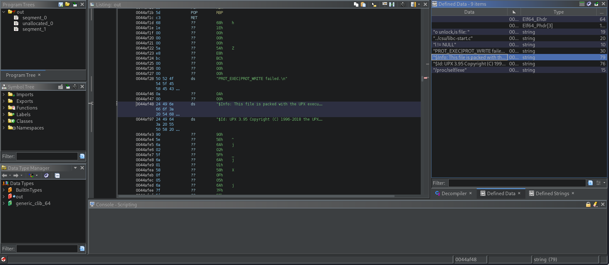
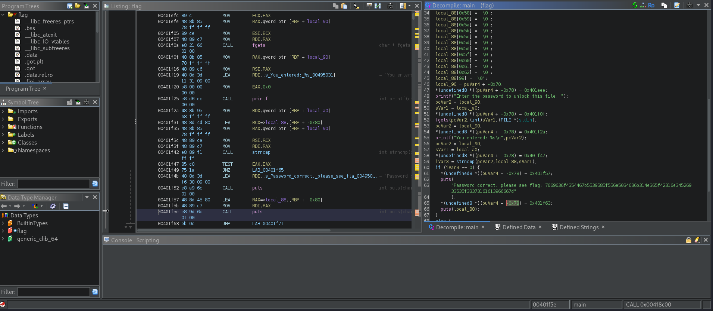

# Packer
## Description
Reverse this linux executable? binary 

### Hints 
1. What can we do to reduce the size of a binary after compiling it.

## Solution
Starting by downloading the binary and running it;
```
└─$ ./out       
Enter the password to unlock this file: password
You entered: password

Access denied
```
it needs a password to execute.I used `strings` to get any useful string and I found nothing useful so I swtiched to ghidra

I've found that the binary is compressed using upx
so using the command 
```
└─$ upx -d out -o flag                   
                       Ultimate Packer for eXecutables
                          Copyright (C) 1996 - 2024
UPX 4.2.4       Markus Oberhumer, Laszlo Molnar & John Reiser    May 9th 2024

        File size         Ratio      Format      Name
   --------------------   ------   -----------   -----------
[WARNING] bad b_info at 0x4b718

[WARNING] ... recovery at 0x4b714

    877724 <-    336520   38.34%   linux/amd64   flag

Unpacked 1 file.
```
and back to ghidra but this time for the `flag` the output file form the unpacing.

and got the flag in hexadecimal I think, using the following python 2 lines of codes, I converted it into plaintext.
```
hex_flag = "7069636f4354467b5539585f556e5034636b314e365f42316e345269 33535f33373161613966667d"
print(bytes.fromhex(hex_flag).decode('utf-8'))
```
output `picoCTF{U9X_UnP4ck1N6_B1n4Ri3S_371aa9ff}`
PWNED!