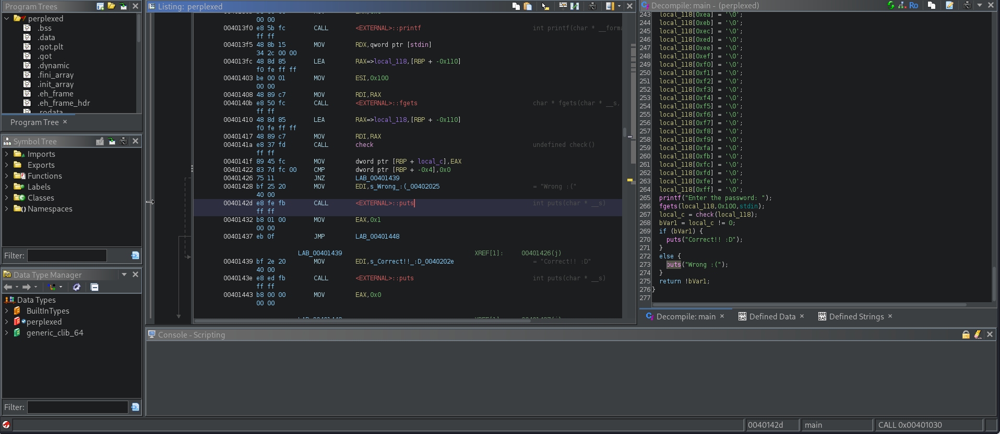
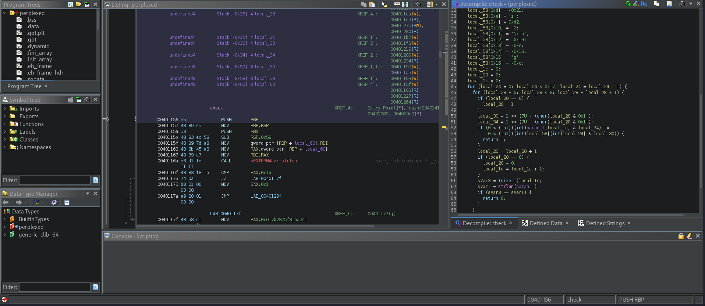

# Perplexed
## Description
Download the binary here. 

### Hints
none.

## Solution
Starting by downloading the binary and examine the characteristics usign the `file perplexed` command;
```
perplexed: ELF 64-bit LSB executable, x86-64, version 1 (SYSV), dynamically linked, interpreter /lib64/ld-linux-x86-64.so.2, BuildID[sha1]=85480b12e666f376909d57d282a1ef0f30e93db4, for GNU/Linux 3.2.0, not stripped
```
giving it the permission to execute using the command `chmod +x perplexed`, and I used `strings perplexed` for checking if there is any intersting string;
```
/lib64/ld-linux-x86-64.so.2
fgets
stdin
puts
strlen
__libc_start_main
printf
libc.so.6
GLIBC_2.2.5
GLIBC_2.34
__gmon_start__
PTE1
H=(@@
u#{aH
Enter the password: 
Wrong :(
Correct!! :D
;*3$"
-------Omitted Output-------
``` 
So from the dumped output I see that the program will ask for a password for getting the flag, so I run the program for more reconnaissance.
```
└─$ ./perplexed          
Enter the password: picoCTF
Wrong :(
```
I hoped to ghidra in a hope to find the password directly;
I've change the comparison value to one, that it will compare to zero in the memory location at the  0040142D, so whatever password I enter it will accept it and the password which is correct it denies it.

I've exported the program and run the new program and that worked
```
└─$ ./perplexed_test 
Enter the password: 0
Correct!! :D
```
But I can't see a flag so I read the question again but nothing important, not to mention that there is no hints.

Then I returned back to ghidra to check if there is anything else and there is the `check()` function that has method to return the flag if the password is right;
```
v3 = "617B2375F81EA7E1".lower()
v4_0 = "D269DF5B5AFC9DB9".lower()
v4_1 = "F467EDF4ED1BFED2".lower()

def to_LE(h):
    r = bytes.fromhex(h)[::-1].hex()
    return r

t = to_LE(v3)
s = to_LE(v4_0) + to_LE(v4_1)[2:]

full = bytes.fromhex((t+s))

print(full.hex())

a1 = []
v11 = 0
v10 = 0

for i in range(23):
    for j in range(8):
        if v10 == 0:
            v10 = 1
        v6 = 1 << (7 - j)
        v5 = 1 << (7 - v10)
        a1.append(str((v6 & full[i]) >> (7-j)))
        v10 += 1
        if (v10 == 8):
            v10 = 0
            v11 += 1
        if v11 == 27:
            break

a1 = a1 + ["0"] * (7 - (len(a1) % 7)) 
result = []

for i in range(0, len(a1), 7):
    result.append(int("".join(a1[i:i+7]), 2))

password = bytes(result)
print(password)
```
using the above python code I reversed the process and get the flag refer to this [Writeup](https://medium.com/@random1106/picoctf-writeup-perplexed-84475f11e57a)
PWNED!