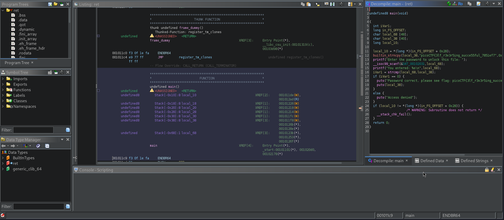

# Reverse
## Description
Try reversing this file? Can ya? I forgot the password to this file. Please find it for me?

### Hints
none

## Solution
Starting by downloading the file provided in the challenge and examine the content using `file ret`
```
ret: ELF 64-bit LSB pie executable, x86-64, version 1 (SYSV), dynamically linked, interpreter /lib64/ld-linux-x86-64.so.2, BuildID[sha1]=d19709b8777cf6b55ef3d1321b36009454db6920, for GNU/Linux 3.2.0, not stripped
```
and it was an executable so giving it the permission to execute using the command `chmod +x ret` before running I wanted to check if any string can be extracted from the program using the command `strings ret` and actually that worked
```
strings ret | grep pico            
picoCTF{H
Password correct, please see flag: picoCTF{3lf_r3v3r5ing_succe55ful_7851ef7d}
```
but I will look for another method too, so I run the program;
```
Enter the password to unlock this file: hello
You entered: hello
Access denied
```
and access denied I hoped to ghidra for deeper analysis.

PWNED!