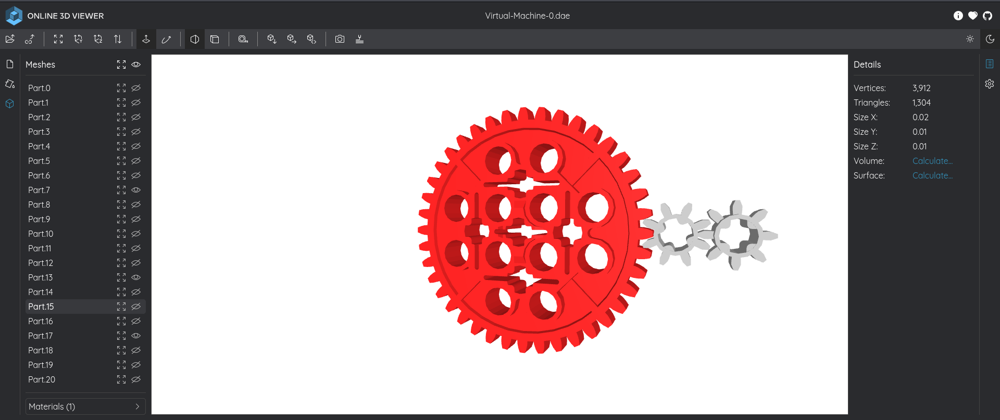

# Virtual Machine 0
## Description
Can you crack this black box? We grabbed this design doc from enemy servers: Download. We know that the rotation of the red axle is input and the rotation of the blue axle is output. The following input gives the flag as output: Download.

### Hints
1. Rotating the axle that number of times is obviously not feasible. Can you model the mathematical relationship between red and blue?

## Solution
After downloading the document for the enemies server in the challenge `Virtual-Machine-0.zip` I unzipped the file using the command `unzip Virtual-Machine-0.zip` and got a file `Virtual-Machine-0.dae` and that file wasn't useful at the moment. I looked for the next file `input.txt` and got the value `39722847074734820757600524178581224432297292490103995908738058203639164185`. using an online tool for visaulizing xml files [3dViewer](https://3dviewer.net/index.html)

and got the red axcel and other axcel no the blue but we will consider it as blueas there is no other axel and all of the 3 small have 8 pins so it won't matter to choose any one of them, and the large red axel has 40 pins. And given in the question that the input is the pins of the large axel and the output is the pins of the small axel, which means $\frac{40}{x} = 8$, which means the ***x = 5***. Now we need to take the input value and multiply it by 5 to see what will be the if the axel rotated 5 times. Using a python script
```
input = 39722847074734820757600524178581224432297292490103995908738058203639164185
output = input * 5
hex_value = hex(output).replace('0x','')
flag = bytes.fromhex(hex_value).decode('utf-8')
print(flag)
```
output `picoCTF{g34r5_0f_m0r3_3537e50a}`
PWNED!