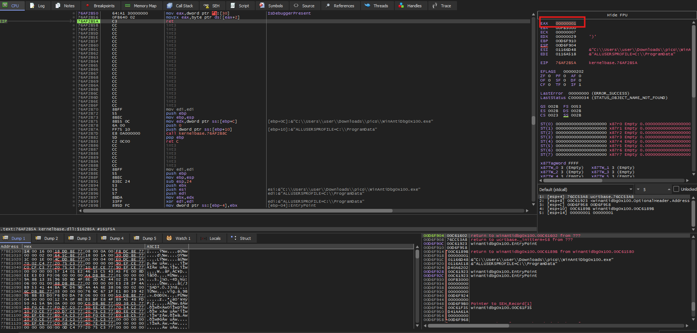
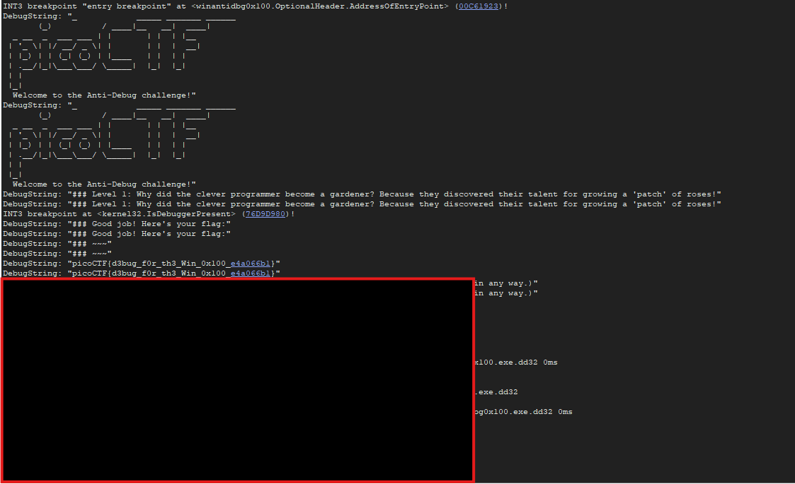

# WinAntiGDB0x100
## Description
This challenge will introduce you to 'Anti-Debugging.' Malware developers don't like it when you attempt to debug their executable files because debugging these files reveals many of their secrets! That's why, they include a lot of code logic specifically designed to interfere with your debugging process. Now that you've understood the context, go ahead and debug this Windows executable! This challenge binary file is a Windows console application and you can start with running it using cmd on Windows. Challenge can be downloaded here. Unzip the archive with the password picoctf 

### Hints
1. Hints will be displayed to the Debug console. Good luck!

## Solution 
Started by downloading the zip file and extracting the content with the password "picoctf" and I've found `config.bin  WinAntiDbg0x100.exe  ` and in the question said that this binary will run only in windows shell and nothing to do in linux so I tried to check for any interesting thing ghidra, and as expected nothing found, so I head up to windows specifically for an debugger called "x64dbg" that can work only in windows.
and I run the "WinAntiDbg0x100.exe" in the debugger and from ***Symbols > WinAntiDbg0x100.exe > isDebuggerPresent*** then I kept a break point there, so I can see what is going on. 
and I've undsterood that at the end if the program detected a debugger it returns 1 to the eax so we got to change the value for `00000000` so no debugger will be detected

and by continuing the program the flag appears in the logs
