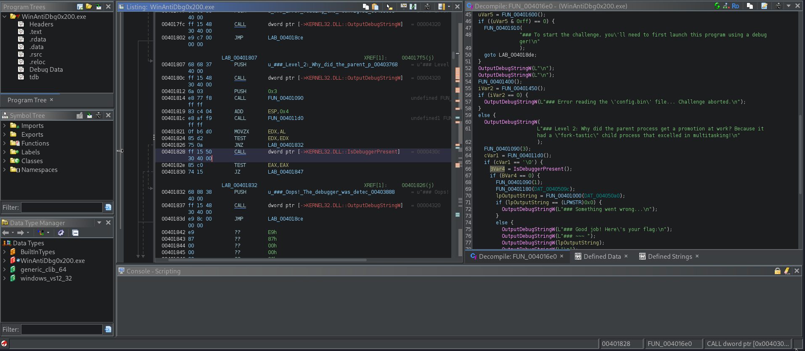

# WinAntiDBG0x200
## Description
If you have solved WinAntiDbg0x100, you'll discover something new in this one. Debug the executable and find the flag! This challenge executable is a Windows console application, and you can start by running it using Command Prompt on Windows. This executable requires admin privileges. You might want to start Command Prompt or your debugger using the 'Run as administrator' option. Challenge can be downloaded here. Unzip the archive with the password picoctf

### Hints
1. Hints will be displayed to the Debug console. Good luck!

## Solution
Started by downloading the zip file and extracted `WinAntiDbg0x200.exe` binary to examine any useful information in ghidra.
and by analyzing the program and memory locations I was eable to to catch the condition that allow me to get the flag in this picture

I compared the 3 conditions:
1. xxxx16eb for error permission and this value has to be 1
2. xxxx1824 for checking if the debugger is running, this value has to be 0
3. xxxx182e fir checking if somehting goes wrong in debugging and printing the flag, this value has to be 0

after modifying the values in `WinAntiDbg0x200.exe` and check the console I've found the flag already given that means the steps we followed are right.

```
DebugString: "_            _____ _______ ______  
       (_)          / ____|__   __|  ____| 
  _ __  _  ___ ___ | |       | |  | |__    
 | '_ \| |/ __/ _ \| |       | |  |  __|   
 | |_) | | (_| (_) | |____   | |  | |      
 | .__/|_|\___\___/ \_____|  |_|  |_|      
 | |                                       
 |_|                                       
  Welcome to the Anti-Debug challenge!"
DebugString: "_            _____ _______ ______  
       (_)          / ____|__   __|  ____| 
  _ __  _  ___ ___ | |       | |  | |__    
 | '_ \| |/ __/ _ \| |       | |  |  __|   
 | |_) | | (_| (_) | |____   | |  | |      
 | .__/|_|\___\___/ \_____|  |_|  |_|      
 | |                                       
 |_|                                       
  Welcome to the Anti-Debug challenge!"
DebugString: "### Level 2: Why did the parent process get a promotion at work? Because it had a "fork-tastic" child process that excelled in multitasking!"
DebugString: "### Level 2: Why did the parent process get a promotion at work? Because it had a "fork-tastic" child process that excelled in multitasking!"
INT3 breakpoint at winantidbg0x200.00071824!
INT3 breakpoint at winantidbg0x200.0007182E!
Thread 19576 created, Entry: ntdll.77C36030, Parameter: 00EECEF8
DebugString: "### Good job! Here's your flag:"
DebugString: "### Good job! Here's your flag:"
DebugString: "### ~~~"
Thread 14040 created, Entry: ntdll.77C36030, Parameter: 00EECEF8
DebugString: "### ~~~"
DebugString: "picoCTF{0x200_debug_f0r_Win_ce2f78e8}"
DebugString: "picoCTF{0x200_debug_f0r_Win_ce2f78e8}"
DebugString: "### (Note: The flag could become corrupted if the process state is tampered with in any way.)"
DebugString: "### (Note: The flag could become corrupted if the process state is tampered with in any way.)"
--------Omitted Output--------
```