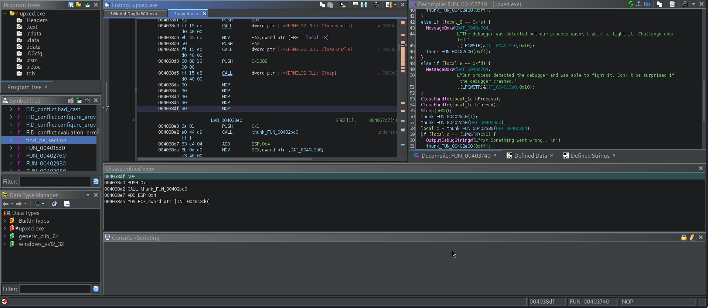
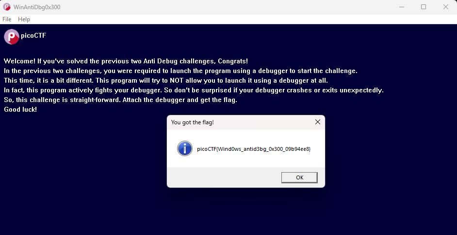

# WinAntiDBG0x300
## Description
This challenge is a little bit invasive. It will try to fight your debugger. With that in mind, debug the binary and get the flag! This challenge executable is a GUI application and it requires admin privileges. And remember, the flag might get corrupted if you mess up the process's state. Challenge can be downloaded here. Unzip the archive with the password picoctf If you get "VCRUNTIME140D.dll" and "ucrtbased.dll" missing error, then that means the Universal C Runtime library and Visual C++ Debug library are not installed on your Windows machine. The quickest way to fix this is:

    Download Visual Studio Community installer from https://visualstudio.microsoft.com/vs/community/
    After the installer starts, first select 'Desktop development with C++' and then, in the right side column, select 'MSVC v143 - VS 2022 C++ x64/x86 build tools' and 'Windows 11 SDK' packages.

This will take ~30 mins to install any missing DLLs. 

### hints
1. There is an infinite loop to constantly check for the debugger.
2. Get past that infinite loop. Maybe 'Patch' the binary to jump to the appropriate location?
3. If you've done everything correctly, the flag should pop-up on your screen after 5 seconds of launching the program. The flag will also be printed to the Debug output to make it easy for you to copy the flag to the clipboard. See 'DebugView' program in Sysinternals Suite.

## Solution
Starting by downloading the zip file and extract the content, I open the program in ghidra and after a while I noticed that the program is packed using the "upx"
so I used the command `upx -d WinAntiDBG.exe -o upxed.exe` and kep analyzing again until I reached to the point where the fore ever loop is repeating itself each 5 seconds

I changed the unconditional jump instruction into "NOP" this instruction, tells the CPU 'do nothing for one cycle or the few next cycles' so the 5 second cycle does nothing and decryption of the flag takes place.
and I ran the the new program I named `flag.exe` and exactly after 5 seconds I got the flag in a pop up window

PWNED!